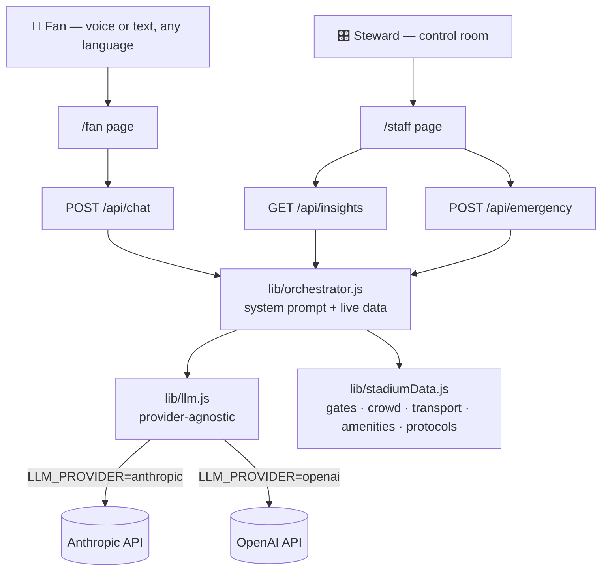

<div align="center">

# 🏟️ StadiumSense AI

### One AI. Every gate. Every fan. Every steward.

A single GenAI-powered companion that unifies fan experience and stadium operations for **FIFA World Cup 2026** — built for **Hack2Skill PromptWars (Virtual) · Challenge 4: Smart Stadiums & Tournament Operations**.

[](https://nextjs.org/)
[](https://react.dev/)
[](#-tech-stack)
[](#-license)
[](#)

**[Live Demo](#)** &nbsp;·&nbsp; **[Report a Bug](../../issues)** &nbsp;·&nbsp; **[Request a Feature](../../issues)**

</div>

<br/>

## 📋 Table of Contents

- [The Problem](#-the-problem)
- [The Solution](#-the-solution)
- [Feature Breakdown](#-feature-breakdown-all-7-challenge-areas)
- [How It's Different](#-how-its-different-one-brain-not-seven-demos)
- [Architecture](#-architecture)
- [Tech Stack](#-tech-stack)
- [Getting Started](#-getting-started)
- [Environment Variables](#-environment-variables)
- [Project Structure](#-project-structure)
- [Testing](#-testing)
- [Deployment](#-deployment)
- [Accessibility](#-accessibility)
- [Security](#-security)
- [Design Philosophy](#-design-philosophy)
- [Roadmap](#-roadmap)
- [License](#-license)

<br/>

## 🎯 The Problem

FIFA World Cup 2026 will bring unprecedented crowds to stadiums across North America — fans speaking dozens of languages, navigating unfamiliar venues, competing for transport, and relying on organizers, volunteers, and venue staff who need real-time situational awareness across an entire tournament, not just a single match day. Today, these problems are solved by **disconnected tools**: a static wayfinding map, a separate transit app, a walkie-talkie radio for incidents, a translated PA announcement. None of them talk to each other, none of them adapt in real time, and none of them are aware of the tournament schedule they're operating inside.

## 💡 The Solution

**StadiumSense AI** replaces that patchwork with **one GenAI orchestrator** grounded in a live "digital twin" of the stadium *and* the tournament match it's currently operating (see `TOURNAMENT_CONTEXT` in `lib/stadiumData.js` — venue, stage, kickoff time, expected attendance, volunteers on shift). The same live data feeds both:

- 🙋 **A fan-facing assistant** — voice or text, any of 6 languages, one continuous conversation covering navigation, crowd avoidance, accessibility, and transport.
- 🎛️ **A staff control-room dashboard** — for organizers, volunteers, and stewards — with AI-generated operational briefings and instant, numbered action plans for real-world incidents.

No feature is bolted on. Every capability reasons over the *same* data model, so a fan asking "which gate is quietest?" and a steward reading the "3 gates above normal density" briefing are looking at the exact same live picture — grounded in the specific match, venue, and moment in the tournament.

<br/>

## ✅ Feature Breakdown (all 7 challenge areas)

| # | Area | Surface | Implementation |
|---|---|---|---|
| 1 | **Navigation** | `/fan` | AI gives turn-by-turn guidance to gates, seats, and amenities, grounded in `lib/stadiumData.js` — never invented, always real to the data model |
| 2 | **Crowd Management** | `/fan`, `/staff` | Live per-gate density simulation rendered as an animated SVG heatmap; AI proactively suggests calmer alternate gates |
| 3 | **Accessibility** | `/fan` | Voice input & read-aloud output (Web Speech API), high-contrast toggle, Gate E (Accessible Entry) always surfaced when relevant, full keyboard navigation, `aria-live` chat region |
| 4 | **Transportation** | `/fan` | Live-status mock feed for metro, shuttle, ride-share & parking; AI recommends the fastest option |
| 5 | **Multilingual Assistance** | `/fan` | One assistant, 6 languages — the same orchestrator replies in whichever language is selected, no app-switching |
| 6 | **Operational Intelligence** | `/staff` | `/api/insights` turns live gate/transport data into a control-room-style staffing briefing for organizers and volunteers, cached per-minute and regenerated as conditions change |
| 7 | **Real-Time Decision Support** | `/staff` | `/api/emergency` converts a reported incident (medical, fire, overcrowding, lost person) into an immediate, numbered action plan grounded in the nearest gate & medical post |

Every page also surfaces a **match-day context strip** (`components/MatchDayBanner.js`) — tournament, stage, venue, kickoff time, expected attendance, and volunteers on shift — so the AI's answers are visibly grounded in a specific FIFA World Cup 2026 match, not a generic venue.

<br/>

## 🧠 How It's Different: One Brain, Not Seven Demos

The unifying idea lives in `lib/orchestrator.js`: a **single system prompt** has live gate, crowd, transport, and amenity data injected into it at request time. The model reasons about navigation, crowd levels, accessibility, and transport as **one continuous conversation** — not seven disconnected tools stitched together for a demo.



<br/>

## 🛠️ Tech Stack

| Layer | Choice | Why |
|---|---|---|
| Framework | **Next.js 14** (Pages Router) | One codebase for frontend *and* serverless API routes — no separate backend to host |
| UI | **React 18**, hand-rolled CSS design system | Full control over a distinctive visual identity instead of default component-library styling |
| AI | **Anthropic Claude** or **OpenAI**, switchable via `.env` | `lib/llm.js` abstracts both behind one function — zero vendor lock-in |
| Voice | **Web Speech API** (native browser) | No extra dependency, graceful no-op on unsupported browsers |
| Testing | **Jest** | Fast, zero-config unit tests for the data model, orchestrator, and provider logic |
| Hosting | **Vercel** (recommended) | Native Next.js support, auto-deploy on `git push`, generous free tier |

<br/>

## 🚀 Getting Started

### Prerequisites
- [Node.js](https://nodejs.org/) 18 or later
- An API key from [Anthropic Console](https://console.anthropic.com/) **or** [OpenAI Platform](https://platform.openai.com/)

### Installation

```bash
git clone https://github.com/raghav-marda/stadiumsense-ai.git
cd stadiumsense-ai
npm install
cp .env.example .env.local
```

Open `.env.local` and add your key (see [Environment Variables](#-environment-variables) below), then:

```bash
npm run dev
```

Visit **http://localhost:3000** — you should land on the StadiumSense AI homepage with a live-pulsing stadium map.

<br/>

## 🔑 Environment Variables

| Variable | Required | Description |
|---|---|---|
| `LLM_PROVIDER` | No — defaults to `gemini` | `gemini`, `anthropic`, or `openai` |
| `GEMINI_API_KEY` | If provider is `gemini` (default) | From [aistudio.google.com](https://aistudio.google.com) — **no credit card required** |
| `GEMINI_MODEL` | No | Defaults to `gemini-2.5-flash-lite` (highest free-tier daily quota — see note below) |
| `ANTHROPIC_API_KEY` | If provider is `anthropic` | From [console.anthropic.com](https://console.anthropic.com/) — card required for billing |
| `ANTHROPIC_MODEL` | No | Defaults to `claude-sonnet-4-6` |
| `OPENAI_API_KEY` | If provider is `openai` | From [platform.openai.com](https://platform.openai.com/) — card required |
| `OPENAI_MODEL` | No | Defaults to `gpt-4o-mini` |

> `.env` / `.env.local` are git-ignored — never commit real keys. See `.env.example` for the template.
>
> **Don't have a credit card?** Use `LLM_PROVIDER=gemini`. Google AI Studio issues a
> free API key with just a Google account — no card, no phone verification.

<br/>

## 📁 Project Structure

```
stadiumsense-ai/
├── components/
│   ├── ChatWindow.js       # Chat transcript with typing indicator
│   ├── LanguageSelector.js # Multilingual switcher
│   ├── MatchDayBanner.js   # Tournament/match context strip (venue, kickoff, volunteers)
│   ├── Navbar.js           # Sticky nav with active-route highlighting
│   ├── StadiumMap.js       # Signature animated SVG heatmap (memoized)
│   └── VoiceInput.js       # Web Speech API wrapper (accessibility)
├── lib/
│   ├── cache.js             # TTL cache — avoids redundant LLM calls
│   ├── formatApiError.js    # Shared API-error-to-string formatter (DRY)
│   ├── llm.js                # Provider-agnostic Anthropic ⇄ OpenAI ⇄ Gemini caller
│   ├── orchestrator.js       # The "one brain" — grounded system prompt
│   ├── stadiumData.js        # Mock digital twin: gates, crowd, transport, tournament context
│   └── types.js              # Shared JSDoc @typedef data contracts
├── pages/
│   ├── api/
│   │   ├── chat.js         # Fan assistant endpoint
│   │   ├── insights.js     # Operational intelligence briefing (cached)
│   │   └── emergency.js    # Real-time decision support
│   ├── index.js             # Landing page
│   ├── fan.js               # Fan assistant UI
│   └── staff.js              # Staff control-room dashboard
├── __tests__/                # Jest unit tests
├── .eslintrc.json             # Code-quality linting rules
├── .prettierrc.json           # Formatting rules
├── .editorconfig              # Cross-editor consistency
├── CONTRIBUTING.md            # Contributor guidelines
├── LICENSE                    # MIT
└── styles/globals.css         # Design tokens & responsive system
```

<br/>

## 🧪 Testing

```bash
npm test
```

| Suite | Covers |
|---|---|
| `stadiumData.test.js` | Data model integrity — every section/transport option references a real gate, crowd values stay in `0–100` range, tournament context is well-formed |
| `orchestrator.test.js` | The system prompt grounds all 7 capability areas, the tournament/match context, volunteers, and the selected language |
| `llm.test.js` | Anthropic/OpenAI/Gemini provider-switching and fallback logic (model retirement *and* quota errors), missing-key errors — via mocked `fetch`, no real API calls |
| `cache.test.js` | TTL cache correctly avoids redundant computation within its window and recomputes after expiry |
| `formatApiError.test.js` | Shared error-formatting helper handles present/missing `detail`, missing `error`, and null input |

<br/>

## ☁️ Deployment

1. Push to GitHub (see below if you haven't yet).
2. Go to [vercel.com](https://vercel.com) → **Add New Project** → import this repo.
3. Add the environment variables from `.env.local` in Vercel's project settings.
4. Click **Deploy**. Every future `git push` to `main` auto-redeploys.

```bash
git init
git add .
git commit -m "Initial commit: StadiumSense AI"
git branch -M main
git remote add origin https://github.com/raghav-marda/stadiumsense-ai.git
git push -u origin main
```

<br/>

## ⚡ Efficiency & code quality

- **Server-side response caching** (`lib/cache.js`): the operational
  briefing is grounded in crowd data that only changes once a minute, so
  `/api/insights` caches the LLM's response by that same minute — repeat
  dashboard loads (or multiple stewards viewing at once) don't trigger
  redundant model calls.
- **Memoized rendering**: `StadiumMap` (the most-mounted, most visually
  complex component — it appears on the landing page, fan view, *and*
  staff heatmap) is wrapped in `React.memo` so it doesn't re-render on
  every keystroke in a sibling chat input. Its per-gate crowd lookup uses
  a `Map` built once per render instead of an `Array.find` inside the
  render loop.
- **Memoized derivations**: dashboard stats (busy-gate counts, average
  density) are wrapped in `useMemo` rather than recomputed on every render.
- **DRY error handling** (`lib/formatApiError.js`): the "turn a failed API
  response into a readable message" logic used to be copy-pasted across
  `fan.js` and `staff.js`; it's now one shared, unit-tested function.
- **Build config**: `compress: true` and `poweredByHeader: false` in
  `next.config.js` for smaller responses and one less fingerprinting header.
- **Linting**: `.eslintrc.json` (Next's `core-web-vitals` ruleset) backs
  the existing `npm run lint` script.
- **Complete package manifest**: `package.json` declares `engines.node`,
  `author`, and `license`; a matching root `LICENSE` file backs it up.
- **Formatting & editor consistency**: `.prettierrc.json` and `.editorconfig`
  keep formatting consistent across contributors and editors; `npm run format`
  applies it.
- **Documented data contracts**: `lib/types.js` defines the app's core data
  shapes (`Gate`, `GateStatus`, `ChatMessage`, `TournamentContext`,
  `EmergencyProtocol`) as JSDoc `@typedef`s, referenced from component and
  page-level `@param` comments — editor-level type-checking without adding
  a TypeScript build step.
- **Contributor guidelines**: [`CONTRIBUTING.md`](./CONTRIBUTING.md) documents
  the project's conventions (provider-agnostic AI calls, no secrets in code,
  shared error formatting, test-per-module).

## ♿ Accessibility

- 🎤 Voice input **and** read-aloud output, with graceful no-op on unsupported browsers
- 🔆 High-contrast display toggle
- ⌨️ Visible keyboard focus states everywhere (`:focus-visible`)
- 🎞️ `prefers-reduced-motion` respected — all ambient animations disable automatically
- 📢 `aria-live="polite"` chat region so screen readers announce new replies
- ♿ Accessible Entry (Gate E) always surfaced by the AI when relevant

<br/>

## 🔒 Security

- No API keys are ever committed — `.env` / `.env.local` are git-ignored
- All LLM calls happen **server-side** only (`pages/api/*`) — keys never reach the browser
- Chat history sent to the model is capped at the last 10 turns per request

<br/>

## 🧯 Model deprecation & quota resilience

Two failure modes hit real deployments of this app during development, so
`lib/llm.js` is built to survive both automatically:

1. **Model retirement.** Google periodically retires specific Gemini model
   IDs with little notice (this happened to `gemini-2.5-flash` for new API
   keys in mid-2026). A `404 model not found` triggers an automatic retry
   against the next candidate in the list instead of failing outright.
2. **Per-model free-tier quotas.** Google's newest "flagship" free models
   (e.g. `gemini-3.5-flash`, which `gemini-flash-latest` currently resolves
   to) can carry daily quotas as low as **20 requests/day** — easy to burn
   through during active testing or judging. `gemini-2.5-flash-lite` is
   tried first instead because it carries a far more generous free-tier
   quota (roughly 1,000-1,500 requests/day). A `429 quota exceeded` also
   triggers a retry against the next candidate, since each model has its
   own separate quota bucket.

Set `GEMINI_MODEL` explicitly if you want to pin a specific model instead
of using the built-in candidate list.

<br/>

## 🎨 Design Philosophy

**"Night match under the floodlights."** The visual identity is drawn from real stadium broadcast graphics — pitch green, scoreboard amber, VAR-review red — rather than a generic AI-product look. The signature animated stadium map is reused across the landing page, fan assistant, and staff heatmap, so navigation and crowd management feel like one connected system instead of separate screens.

<br/>

## 🗺️ Roadmap

- [ ] Replace mock crowd data with a real IoT/turnstile sensor feed
- [ ] Live transit API integration (GTFS-realtime)
- [ ] Push notifications for gate-status changes
- [ ] Multi-stadium support for the full tournament schedule

<br/>

## 📄 License

Distributed under the MIT License. See [`LICENSE`](./LICENSE) for details.

<br/>

## ✍️ Author

**Raghav Marda**

<br/>

<div align="center">

Built with 🏟️ for **Hack2Skill PromptWars · Virtual · Challenge 4: Smart Stadiums & Tournament Operations**

</div>
